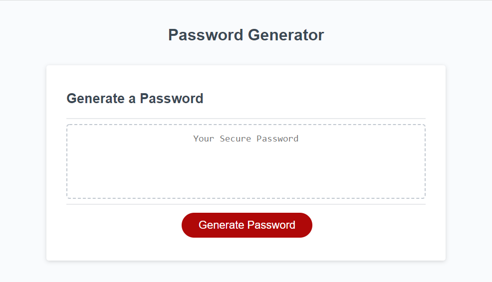
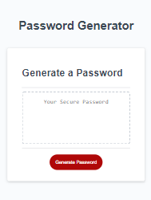

# Password Generator

## Introducing my second coding project. 

This project is my first experience with building the behavior of a web application. I was given a task - to provide employees with access to sensitive data the ability to generate a high security and randomized password. 

The result? A website that uses JavaScript to dynamically generate a randomized password. 

While building this project, I encountered many challenges. The first of which was how to validate a user's input so that errenous values - such as an empty response or a response outside of the specified instructions (like entering 1 for the prompt that asks a user to enter a number between 8 and 128) - would not allow the user to continue until they entered an appropriate value. For this, I added a while loop that would continue to re-prompt the user for a valid response until one was correctly entered. 

I was also given the specification that users had to include at least one type of character (lowercase letters, uppercase letters, numbers, or special characters) in order for the application to proceed. For this, I created a variable named "oneType" that tested to see if a user had entered yes to at least one of the character type prompts. It acts similarly to a switchboard. By default this value is considered false, and if the user enters "yes," the value is then treated as true. If the variable "oneType" is not true by the end of all of the type prompts, the program gives the user an error message and repeats the prompts. This behavior happens until the user enters a valid response. 

These were just a few of the complications that were overcome during the building of this application. As a result my password generator is now robust, with many features in place to prevent the application from returning erronous or broken values. 

## Usage and Features

This is how the main page appears to users. The page is responsive, adapting to multiple screen sizes.

Once the user clicks the "generate password" button, they will be directed through a series of prompts which will ask them which password specifications they would like to include. 

[Insert gif here]

Once the prompts have been completed, a randomized password will be dynamically created and added to the page. 

[Insert gif here]

## Try it for yourself!

<a href="https://ashlynn4567.github.io/Challenge3-PasswordGenerator/">Click here to generate a password!<a>

## Suggestion Box

In the future, I would like to add the following improvements:
- Clicking "cancel" on the window prompt will cancel the password generator at any time and return the user to the main page. 
- A separate button labeled "copy" will dynamically appear next to the existing "generate password button once a password has been generated. If the user clicks this button, the password will automatically be copied to their clipboard. 
- The user will have the option to customize which special characters they would like to include in the password generator. 

I'm a big believer in always refactoring code to improve it's functionality. If you would like to suggest your own improvements, you can reach me at the following links.

 - <a href="https://github.com/ashlynn4567">GitHub<a>
 - <a href="www.linkedin.com/in/Ashley-Lynn-Smith">LinkedIn<a>

## Credits

For the base of this project, I used <a href="https://github.com/coding-boot-camp/friendly-parakeet">this initial codebase</a>, written by Xandromus with coding-boot-camp.
